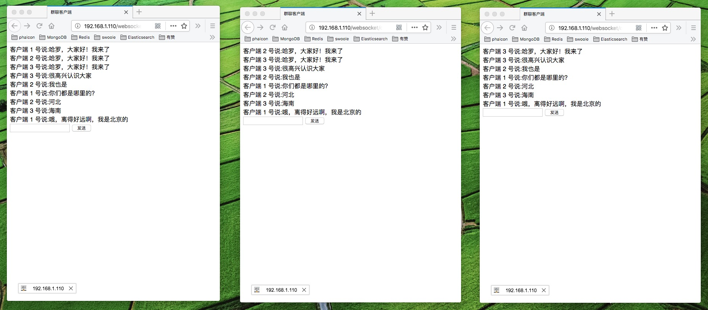
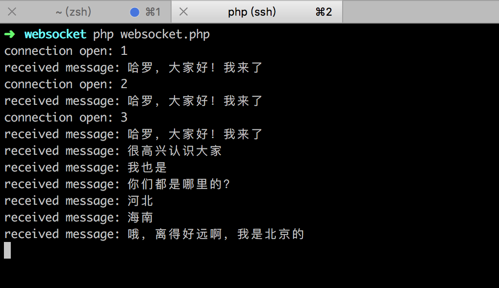

# swoole_demo
分享我在学习Swoole时做的小Demo

## 基于Swoole的聊天室

###测试版
websocket.php socket服务器端
client.html 客户端（js采取原生的javascript，旨在降低阅读的复杂度）

整个逻辑非常简单，就是通过socket链接到服务器端并向每个客户端推送消息的过程。

下载Demo源码：[https://github.com/jiangbianwanghai/swoole_demo/archive/v0.1.zip](https://github.com/jiangbianwanghai/swoole_demo/archive/v0.1.zip)

客户端效果图

服务器端效果图

